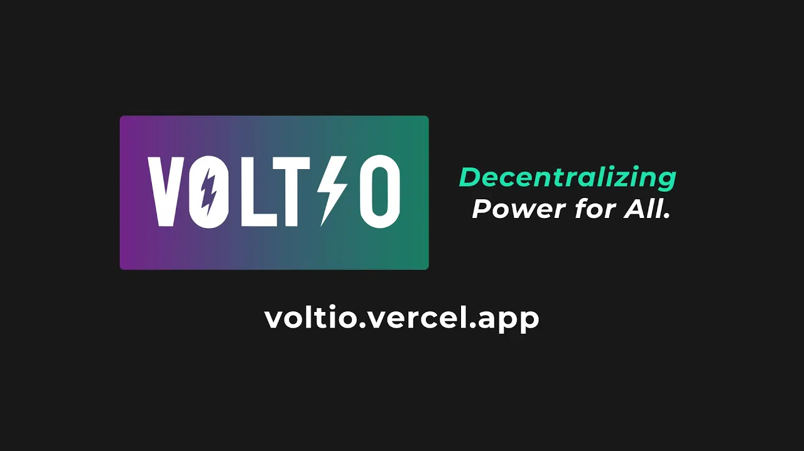

## Voltio

  

<b>Voltio</b> is a Web3 platform that allows users to invest in fractionalized solar energy projects as NFTs  

<i>Now live on Devnet!</I>  
<b>https://voltio.vercel.app/</b>  

<i>Check out our pitch video!</i>  
<b>[Voltio - Demo Day](https://www.youtube.com/watch?v=gQUjW7pLBoQ)</b>  

### Setting it up locally...

Check out this [documentation](./SETUP.md) for more information on setting up Voltio locally

### Contributors

- [ChiefWoods](https://github.com/ChiefWoods)
- [yaphaojian](https://github.com/yaphaojian)
- [Karweiii](https://github.com/Karweiii)
- [eesuhn](https://github.com/eesuhn)
